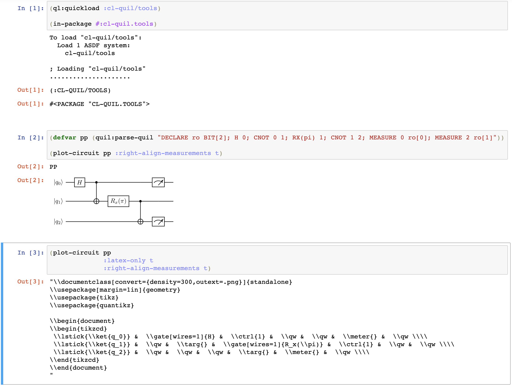

# CL-QUIL/TOOLS

Tools for cl-quil developers.

These provide functionality above and beyond core `cl-quil`, but perhaps at the cost of additional system dependencies (e.g. `graphviz` or `pdflatex`). Read the instructions carefully!

A short summary of what follows in this README is indicated below.

| Section | Description |
| --- | ----------- |
| Circuit Diagrams | Generate plots of circuit diagrams from Quil code.  |
| Hasse Schedule | Visualize `logical-scheduler` data. |

## Circuit Diagrams

Render a Quil `parsed-program` object as a circuit diagram. There are a few possible backends:
- `:jupyter-svg` (default) render to SVG and show inline in a Jupyter notebook
- `:slime-png` render to a PNG and show inline in a Slime session
- `:latex` just produce quantikz source for the diagram

### Example Usage

#### Jupyter

To generate a Jupyter SVG object capable of rendering inline,
```
(plot-circuit <parsed-program>)
```

To save SVG output, use `:output-file <filename>`.

An example Jupyter session is shown below.




#### SLIME


### Installation Instructions

#### `:jupyter-svg`

You will need `pdflatex` and `pdf2svg` in your path. On macOS, `pdflatex` is part of the `mactex` distribution. Both of these may be installed with homebrew:
```
brew install mactex
brew install pdf2svg
```

These executables are referred to in `cl-quil/tools` by `*pdflatex-exe*` and `*pdf2svg-exe`, should you wish to override them.

To use this in a Jupyter notebook, you should use [common-lisp-jupyter](https://github.com/yitzchak/common-lisp-jupyter). As an installation note, some users have found that on macOS the default SBCL path associated with the jupyter kernel (e.g. in `~/Library/Jupyter/kernels/common-lisp/kernel.json`) is incorrect; this will result in `jupyter` being unable to start the Common Lisp kernel.

#### `:slime-png`

You need `pdflatex` (cf. above) and `convert` (from ImageMagick) in your path. These executables are referred to in `cl-quil/tools` by `*pdflatex-exe*` and `*convert-exe*`, should you wish to override them.

The Slime interaction requires two SLIME contribs: `slime-media` and `slime-repl` (which is included in `slime-fancy`). In addition, you must enable SLIME evaluation in Emacs. This all can be done, for example, by the following (from `config.el`):

```
(slime-setup '(slime-fancy slime-media))
(setq slime-enable-evaluate-in-emacs t)
```


## Hasse Schedule

The *Hasse schedule* tool helps you to visualize the *logical-scheduler* data structure, which is used by the addresser to organize and manage resource dependencies between instructions on 'logical' qubits.

Quil instructions rely on some mixture of classical (memory regions) and quantum (qubits) resources. In the general case, it is these resource dependencies, rather than the strict linearization of straight line quil, which dictate the sequencing of physical instructions. For example, in the program
```
  X 0          (i)
  H 3          (ii)
  CNOT 0 1     (iii)
  X 3          (iv)
  CNOT 1 3     (v)
```
the instructions (iii) and (iv) could have equivalently been transposed. The partial ordering imposed by resource constraints is fully described by a logical-scheduler instance. While one can grasp the logical ordering by inspecting a logical-scheduler instance in Lisp, it is more convenient to grasp if visualized, as with the following Hasse diagram:

> 

where the arrow A ---> B means that A logically follows B.

The Hasse schedule tool implements utilities for creating a Hasse diagram for a quil program or for a logical-scheduler instance or for a parse derived from a quil program. The resulting diagram indicates the partial ordering of the instructions. The diagram is in the form of a GraphViz source file, called a "dot file", conventionally named with file type ending ".gv".

The dot file can be readily transformedp into various kinds of image files. Given a file such as "example-1.gv", it can be converted to various viewable formats and then viewed in numerous possible ways. Here are some example command lines that should work on any sort Linux or MacOS with GraphViz installed. (Note that 'dot' is the GraphViz program for drawing directed graphs.)

```
dot -Tpdf example-1.gv -o g.pdf
  -- convert the dot file to a PDF file named "g.pdf"

dot -Tpng example-1.gv -o g.png
   -- convert the dot file to a PNG file named "g.png"
```
The resulting image file can then be shown in various software, such as image viewers, PDF viewers, and web browsers.

Here is an example of using this tool:
In Lisp, if necessary, evaluate the following to load cl-quil/tools:
```
(asdf:load-system :cl-quil/tools)
```
Then try creating a Hasse diagram for the simple program shown above:
```
(tools:write-hasse-for-quil "X 0; H 3; CNOT 0 1; X 3; CNOT 1 3" :output-file "e1.gv")
; => "e1.gv"
```
That produced a GraphViz dot file with the following contents:
```
digraph G {
    rankdir=BT;
    "H 3 [5]" [label = "H 3"]
    "X 3 [4]" [label = "X 3"]
    "CNOT 1 3 [3]" [label = "CNOT 1 3"]
    "X 0 [2]" [label = "X 0"]
    "CNOT 0 1 [1]" [label = "CNOT 0 1"]
    "X 3 [4]" -> "H 3 [5]"
    "CNOT 1 3 [3]" -> "X 3 [4]"
    "CNOT 1 3 [3]" -> "CNOT 0 1 [1]"
    "CNOT 0 1 [1]" -> "X 0 [2]"
}

# X 0; H 3; CNOT 0 1; X 3; CNOT 1 3
```
Notice that the quil program code, if available, appears below the GraphViz code as a comment, just as a convenience.

Now in the shell, you can convert that file to, say, a PNG image file with this command:
```
dot -Tpng e1.gv -o e1.png
```
Now, you can view the new image file ("e1.png") in some image browsing tool. On MacOS, e.g., you can just do ``'open e1.png'`` to invoke the default image viewer on the file, finally resulting in the Hasse diagram image shown above.
